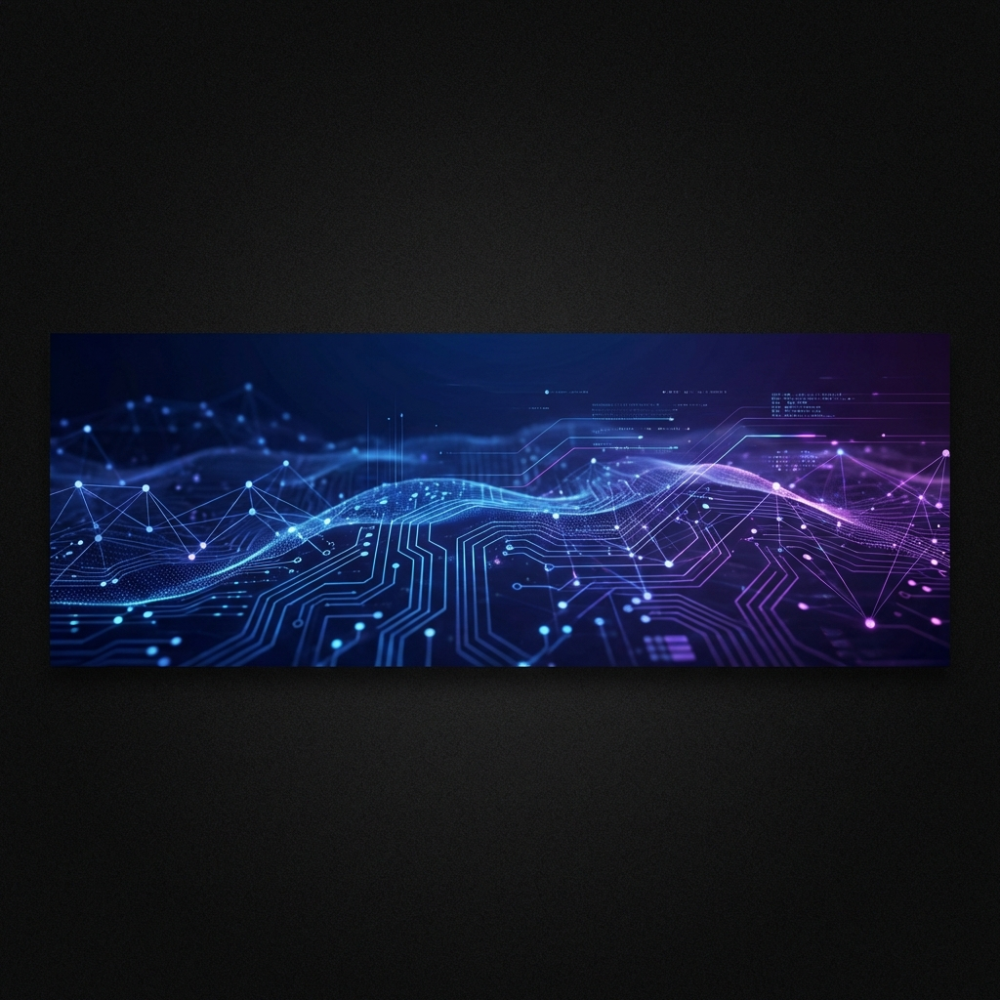

  

<h1 align="center">Hi, I'm Pradeep 👋</h1>

  <b>Architecting AI Systems • Enterprise Platforms • Distributed Backends</b>

  
  
  

---

  
  

---

## 🚀 About Me

I design and build **production-grade AI platforms** and **enterprise-scale systems** that operate under real-world constraints.
Currently architecting context-aware conversational AI systems with hybrid vector retrieval, adaptive memory pipelines, and scalable microservice backends.

I also lead enterprise system design for large **manufacturing ecosystems**, translating SAP-driven procurement, costing, and raw material workflows into scalable SaaS platforms.

---

## 🛠️ Tech Stack & Arsenal

### Backend & Infrastructure

  
  
  
  
  
  
  
  

### AI & Data Engineering

  
  
  
  
  

### Frontend

  
  
  

---

## � Contracting & Services

I specialize in building high-performance systems for complex domains. If you need an architect who understands both **code** and **business logic**, let's talk.

| Service | Description |
| :--- | :--- |
| **AI System Architecture** | RAG pipelines, Vector Search, LLM Integration, Custom Agents |
| **Enterprise Backend** | Microservices (NestJS/FastAPI), High-load APIs, Event-driven logic |
| **SaaS Development** | Full-cycle development from MVP to Scalable Product |
| **Optimization** | Database tuning, Latency reduction, Cost modeling |

> [!TIP]
> **Open for Contracting**: Currently accepting select projects in **AI Infrastructure** and **Enterprise SaaS**.

  

---

## 🧠 What I'm Building

- **Conversational AI**: Context-aware memory pipelines & hybrid retrieval.
- **Supply Chain Engines**: SAP-integrated procurement & costing modules.
- **Distributed Systems**: Scalable architectures using Kong, Redis, and Cloud Run.

---

  <i>"Building systems that connect AI intelligence with enterprise reality."</i>

